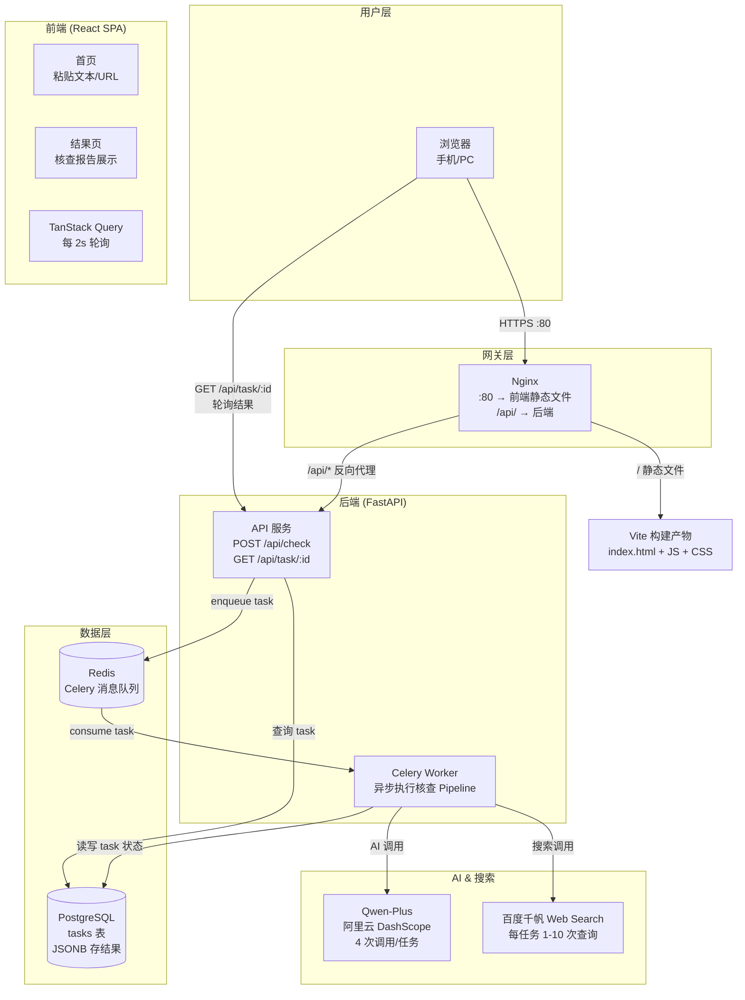
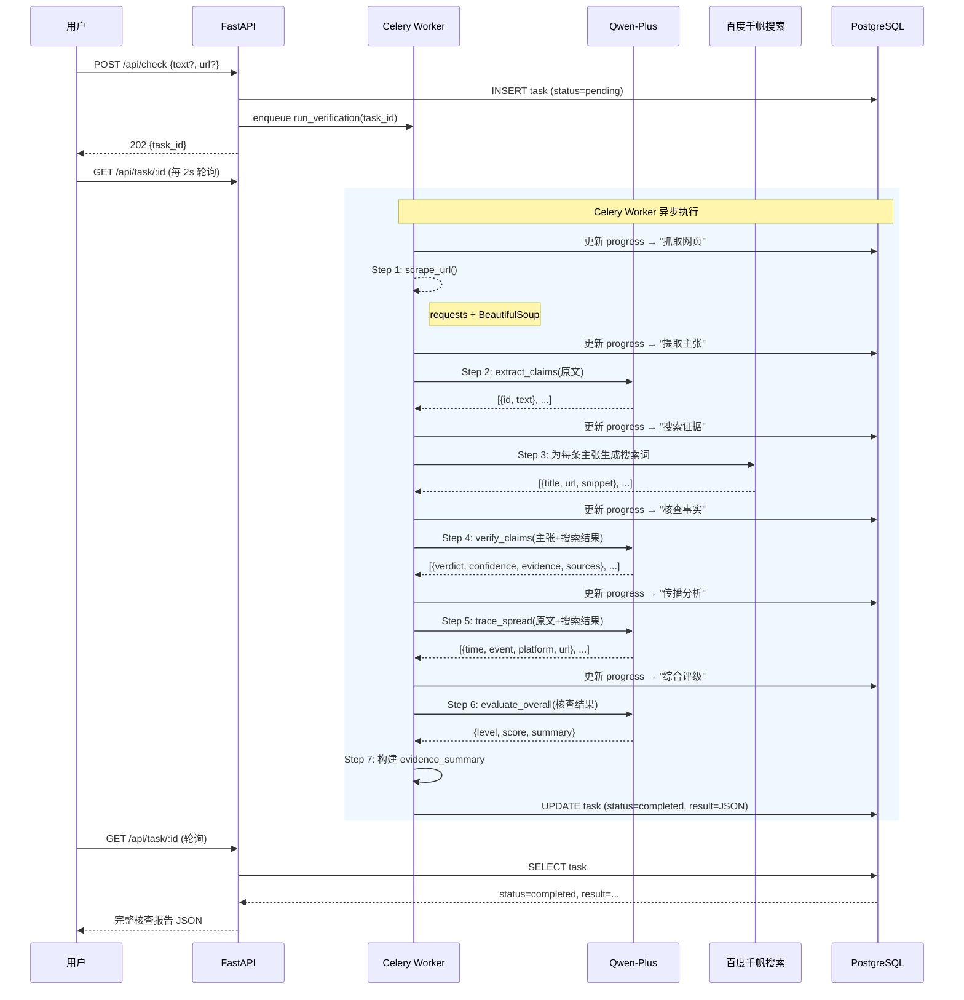
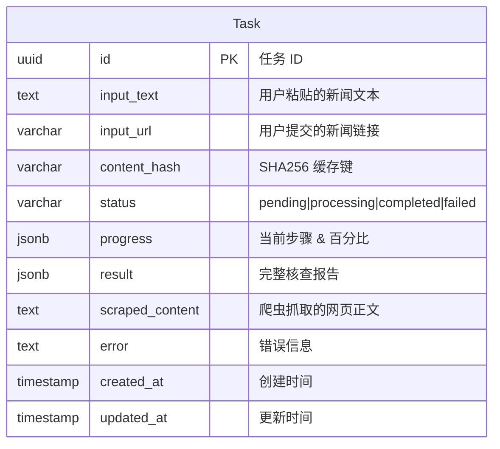
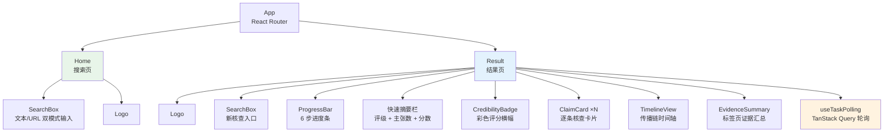
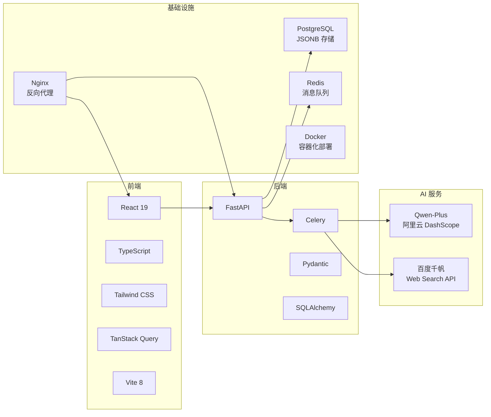

# 新闻求真 — 项目架构 & 技术栈文档

## 1. 项目概述

**新闻求真**是一款 AI 驱动的中文新闻事实核查工具。用户粘贴新闻文本或链接，系统自动提取事实主张、搜索证据、逐条核查、还原传播链、给出综合可信度评级。

---

## 2. 系统架构



---

## 3. 核查 Pipeline



---

## 4. 数据模型



**result 字段结构（JSONB）：**

```json
{
  "credibility_rating": {
    "level": "trusted | dubious | fake",
    "score": 0-100,
    "summary": "2-3 句话综合评价"
  },
  "claims": [{
    "id": 1,
    "text": "主张原文",
    "verdict": "true | false | dubious",
    "confidence": 0-100,
    "evidence": "核查理由",
    "sources": ["url1", "url2"]
  }],
  "timeline": [{
    "time": "2026-05-14 10:00",
    "event": "事件描述",
    "platform": "微博/微信/抖音等",
    "url": "来源链接或 null"
  }],
  "evidence_summary": {
    "supporting": [{"url": "...", "explanation": "..."}],
    "opposing": [{"url": "...", "explanation": "..."}],
    "neutral": [{"url": "...", "explanation": "..."}]
  }
}
```

---

## 5. 前端组件树



---

## 6. AI 调用汇总

| Step | 服务 | 模型 | Temp | Max Tokens | 输入 | 输出 |
|:----:|------|------|:----:|:----------:|------|------|
| 2 | extractor | qwen-plus | 0.1 | 4096 | 新闻全文 (≤8000字) | 事实主张列表 |
| 4 | verifier | qwen-plus | 0.1 | 8192 | 主张 + 搜索结果 | 每条主张的判决 |
| 5 | tracer | qwen-plus | 0.3 | 4096 | 原文 + 搜索结果 | 传播时间线 |
| 6 | evaluator | qwen-plus | 0.2 | 2048 | 核查后的主张 | 综合评级 |

每次核查调用 4 次 Qwen API + 1-10 次百度搜索 API。

---

## 7. 技术栈速览



### 选型依据

| 选择 | 原因 |
|------|------|
| **FastAPI** | Pydantic 深度集成、自动 Swagger 文档、原生 async 适合 I/O 密集场景 |
| **Celery + Redis** | 核查询 pipeline 耗时 30-90s，必须异步；Celery 提供重试、持久化、并发控制 |
| **PostgreSQL** | JSONB 字段存 AI 输出的半结构化结果，支持索引，未来可扩展 pgvector |
| **Qwen-Plus** | 中文原生理解、国内合规、成本低（比 GPT-4o 便宜 3-5x） |
| **千帆搜索 API** | 百度官方接口，返回权威性评分 + 时间信息，比 HTML 爬虫稳定可靠 |
| **React + Tailwind** | 结果页精细 UI 定制需求（色条、渐变、折叠卡片）需要原子化 CSS |
| **TanStack Query** | 内置轮询 + 缓存 + 条件停止，比手写 useEffect 健壮 |
| **Vite** | 2024+ 事实标准，冷启动 <1s，HMR 即时 |
| **Web 应用** | 零安装、URL 可分享、链接可点击、复制粘贴无摩擦 |

---

## 8. 项目目录结构

```
news-truth/
├── docker-compose.yml              # 一键启动全部服务
├── news-truth-backend/
│   ├── .env                        # API 密钥配置
│   ├── Dockerfile
│   ├── requirements.txt
│   └── app/
│       ├── main.py                 # FastAPI 入口
│       ├── config.py               # Pydantic Settings
│       ├── database.py             # SQLAlchemy engine（唯一来源）
│       ├── models/
│       │   └── task.py             # Task ORM 模型
│       ├── schemas/
│       │   └── check.py            # 请求/响应 Pydantic 模型
│       ├── api/
│       │   └── check.py            # /api/check + /api/task/:id
│       ├── workers/
│       │   ├── celery_app.py       # Celery 配置
│       │   └── tasks.py            # 7 步核查 Pipeline
│       ├── services/
│       │   ├── scraper.py          # 网页抓取
│       │   ├── extractor.py        # AI 提取主张
│       │   ├── searcher.py         # 百度千帆搜索
│       │   ├── verifier.py         # AI 逐条核查
│       │   ├── tracer.py           # AI 传播链分析
│       │   └── evaluator.py        # AI 综合评级
│       └── utils/
│           └── cache.py            # 24h SHA256 缓存
└── news-truth-frontend/
    ├── Dockerfile
    ├── nginx.conf
    └── src/
        ├── main.tsx                # React 入口
        ├── pages/
        │   ├── Home.tsx            # 搜索页
        │   └── Result.tsx          # 结果页
        ├── components/
        │   ├── SearchBox.tsx       # 输入组件
        │   ├── ProgressBar.tsx     # 进度条
        │   ├── CredibilityBadge.tsx # 评级横幅
        │   ├── ClaimCard.tsx       # 主张卡片
        │   ├── TimelineView.tsx    # 时间轴
        │   └── EvidenceSummary.tsx # 证据汇总
        ├── hooks/
        │   └── useTaskPolling.ts   # 轮询 Hook
        ├── types/
        │   └── index.ts            # TypeScript 类型
        └── constants/
            └── index.ts            # API 地址配置
```
